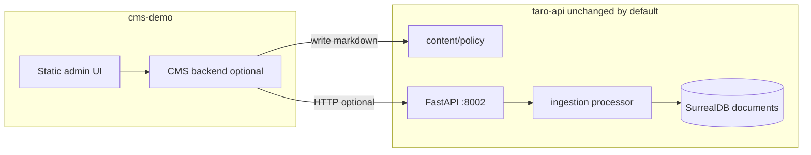

# Self-hosted demo CMS — detailed plan

This document describes a **small, optional CMS** for editing **policy/help markdown** and publishing into Taro’s existing **policy ingestion pipeline**, without refactoring the core agent, schema, or frontend shopping experience.

**Related:** sibling package overview at [`../../cms-demo/README.md`](../../cms-demo/README.md).

---

## Mapping to 6-layer FAQ RAG plan

The FAQ / policy RAG initiative (see internal FAQ policy RAG pipeline ideation) describes **Layers 1–6**: landing → events → processing → index → serving → governed generation. The **CMS demo** only adds a **writer path into Layer 1**; Layers 2–6 stay the **existing Taro** implementation.

| Layer | Role | Taro (existing) | CMS demo |
|-------|------|-----------------|----------|
| **1** | Durable markdown; stable `source_key` | [`taro-api/content/policy/`](../taro-api/content/policy/), [`documents-metadata.md`](./documents-metadata.md) | Writes `*.md` here with correct paths (`policy/foo.md`) |
| **2** | Optional async boundary | [`ingestion/queue.py`](../taro-api/src/ingestion/queue.py), [`POST /ingest/policy`](../taro-api/src/routes/ingestion_route.py) | **Default:** skip (direct publish). **Optional:** `PUBLISH_MODE=enqueue` + webhook + `ingest-drain` for a Layer-2 story |
| **3** | Chunk, hash, embed, upsert | [`ingestion/processor.py`](../taro-api/src/ingestion/processor.py), `python -m ingestion.cli ingest-file` | **Publish** invokes `ingest-file` via subprocess (or enqueue path) |
| **4** | Surreal `documents` | [`schema.surql`](../taro-api/schema/schema.surql) | No CMS code |
| **5–6** | `find`/`grep`, citations, prompts | [`fs_tools.py`](../taro-api/src/tools/fs_tools.py), [`GET /documents/`](../taro-api/src/routes/documents.py) | Optional link to `TARO_API_BASE/documents/...` in UI later |

**Interview line:** “CMS updates **Layer 1**; **Layer 3** ingestion stays idempotent with hash-stable chunks; the agent still retrieves via **Layers 5–6** with `source_key` grounding.”

---

## Goals

| Goal | Detail |
|------|--------|
| **Demo-grade** | Enough for a live walkthrough: edit text → publish → chat retrieves updated policy. |
| **Self-hosted** | Runs on your machine or a VM you control; no SaaS CMS required. |
| **Depends on Taro** | Uses Taro’s **running API** and (directly or indirectly) **`content/policy/` → ingest → `documents`**. |
| **Does not “affect” Taro** | No change to default Taro behaviour when the CMS is **off** or **not installed**; no edits to agent prompts, `seed.py`, or product flows unless explicitly scoped. |

**Non-goals (demo):** multi-user orgs, WYSIWYG legal review workflow, S3, HA, full RBAC.

---

## What “does not affect Taro” means in practice

1. **Separate tree:** All CMS-specific code and static assets live under **`cms-demo/`** at the repo root (sibling to `taro-api/`, `taro-web/`), not mixed into `taro-api/src/` unless you choose **optional additive routes** (see below).
2. **Contract-based integration:** The CMS talks to Taro only through **documented HTTP** (and optionally a **shared folder**). You can delete `cms-demo/` and Taro behaves as today.
3. **Optional glue in `taro-api`:** If you need “save file + ingest in one request,” the only acceptable Taro change is **new, env-gated routes** in a **dedicated module** (e.g. `routes/policy_cms.py`) with `POLICY_CMS_ENABLED=false` by default. That is **additive** and **off** unless you opt in.

---

## Current Taro building blocks (reuse, don’t duplicate)

| Piece | Location | Role |
|-------|----------|------|
| Landing markdown | `taro-api/content/policy/*.md` | Source of truth for policy chunks |
| Ingestion | `taro-api/src/ingestion/processor.py` | Chunk, hash, embed, write `doc_type=policy` |
| Queue / webhook | `POST /ingest/policy`, `INGEST_WEBHOOK_SECRET` | Enqueue upsert/delete (worker must drain if using queue) |
| Retrieval | `find` / `grep` in `fs_tools.py` | Agent reads policy from Surreal |
| Citation API | `GET /documents/{chunk_ref}` | Optional UI for sources |

**Gap for a browser editor:** Taro does **not** expose GET/PUT for raw markdown files today. The CMS must either:

- **A — Shared filesystem:** CMS process writes files **into** `taro-api/content/policy/` (same machine or Docker volume), then triggers ingest; or  
- **B — Additive Taro routes:** Optional API on Taro to read/write policy blobs (env-gated); or  
- **C — Out-of-band sync:** CMS writes to its own `drafts/` and a script/rsync copies into `content/policy/` (clumsy for demos).

**Recommendation for demo:** **A + direct ingest call** from a tiny **CMS backend** (see Phase 2) so you don’t need queue drain for every click.

---

## Target architecture



- **Minimum demo:** CMS backend writes to **`../taro-api/content/policy/`** (relative path from `cms-demo` dev layout) and invokes **`ingest_policy_file`** equivalent via **subprocess** `python -m ingestion.cli ingest-file …` with `PYTHONPATH`/`cwd` set to `taro-api/src`, **or** calls a **new optional** Taro route `POST /cms/publish` that wraps the same (additive).

---

## Repository layout (proposed)

```
taro/
  taro-api/          # existing — no CMS code here unless optional routes added
  taro-web/          # existing shop UI — unchanged
  cms-demo/
    README.md
    LAYER2.md        # optional enqueue + drain (Layer 2 demo)
    requirements.txt
    Makefile
    src/cms_app/     # FastAPI app (port 8088)
    static/          # index.html, admin.css, admin.js
```

**Port suggestion:** CMS UI/backend on **8088** (avoid clashing with Surreal 8000/8001, Taro 8002, taro-web 3001).

---

## Phases

### Phase 0 — Prereqs (no code)

- [ ] Taro runs: SurrealDB + `make seed` (or schema + ingest as you already use).
- [ ] Policy pipeline verified: `make ingest-policy`, chat question hits policy.
- [ ] Decide integration: **filesystem + CLI ingest** vs **optional Taro publish endpoint**.

**Exit:** checklist in `cms-demo/README.md`.

---

### Phase 1 — Static UI only (no Taro code changes)

- [ ] Add `cms-demo/static/admin.html`: textarea, dropdown of filenames under `content/policy` (hardcoded list or fetched from a **static JSON** you hand-edit for demo).
- [ ] “Save” downloads a file or copies instructions: “paste into `taro-api/content/policy/foo.md`”.
- [ ] Document: operator runs `make ingest-policy` manually.

**Exit:** demo works with **manual** file save + ingest; proves UX story only.

---

### Phase 2 — CMS backend (recommended for “self-hosted demo”)

Implemented under [`../../cms-demo/`](../../cms-demo/) — see [`../../cms-demo/README.md`](../../cms-demo/README.md), [`.env.example`](../../cms-demo/.env.example), and [`../../cms-demo/Makefile`](../../cms-demo/Makefile).

Small **FastAPI** app in `cms-demo/`:

- [x] **Config:** `TARO_API_BASE`, `TARO_CONTENT_POLICY_DIR`, `TARO_PYTHON`, `CMS_ADMIN_TOKEN`, `PUBLISH_MODE` — see [`../../cms-demo/src/cms_app/settings.py`](../../cms-demo/src/cms_app/settings.py).
- [x] **GET `/api/policies`** — list `.md` files (safe basename only).
- [x] **GET `/api/policies/{name}`** — return file body.
- [x] **PUT `/api/policies/{name}`** — atomic write.
- [x] **POST `/api/publish/{name}`** — **2a:** subprocess `ingestion.cli ingest-file` from `taro-api/src`; **optional enqueue:** [`../../cms-demo/LAYER2.md`](../../cms-demo/LAYER2.md).

**Exit:** browser edit → save → publish → `documents` updated without opening IDE.

---

### Phase 3 — Polish (still demo)

- [ ] Basic styling aligned with `taro-web` (dark theme, typography).
- [ ] Show last publish status / stderr in UI.
- [ ] Link from `taro-web` only as a **footer dev link** (`/admin` on CMS port) — **optional**; keep shop default unchanged.

---

### Phase 4 — Optional additive Taro routes (only if Phase 2 subprocess is ugly)

Add **`routes/policy_cms.py`** in `taro-api`:

- Mounted only if `POLICY_CMS_ENABLED=true` and token set.
- `POST /internal/cms/publish` with `{ "source_key": "policy/foo.md", "body": "..." }` — writes file under `content/` + calls `ingest_policy_file` in-process.

**Exit:** CMS becomes a thin client; still **no change** when env flag is off.

---

## Security (demo)

| Topic | Approach |
|-------|------------|
| **Auth** | Single long random `CMS_ADMIN_TOKEN`; reject if missing/wrong. |
| **Path traversal** | Normalize `name` to basename; only `*.md` under `content/policy`. |
| **Production** | Do not expose CMS port to the internet; use VPN or SSH tunnel. |

---

## Testing checklist (before an interview)

1. Edit a visible sentence in **shipping** or **returns** policy in CMS.
2. Publish; confirm **`make ingest-policy`** not needed manually (if Phase 2).
3. Ask chat: sentence appears in answer or in tool output with **`source_key`**.
4. `GET /documents/pol_...` returns updated **`indexed_at`** / content.

---

## Risks and mitigations

| Risk | Mitigation |
|------|------------|
| Subprocess ingest fails (venv path) | Document absolute path to `taro-api/.venv/bin/python` in `cms-demo/.env`. |
| Queue-based `POST /ingest/policy` only enqueues | For demo, call **direct ingest** (CLI or in-process Taro route), not queue-only. |
| Two writers to same file | Single-user demo; add file lock or “last write wins” note in UI. |

---

## What to say in an interview

“We split a **demo CMS** into **`cms-demo/`** so the commerce stack stays clean. It **writes markdown** into the same **landing zone** Taro already ingests and triggers **embedding + upsert**—same **Surreal `documents`** index and **citations**. Production would swap the filesystem write for **S3 + SQS** and a real CMS, but the **pipeline contract** stays the same.”

---

## Open decisions (fill before implementation)

1. Subprocess ingest vs optional Taro publish route?
2. CMS port and CORS (same-origin via reverse proxy vs dev `localhost:8088`)?
3. Whether to add any link from `taro-web` (default: **no**).
